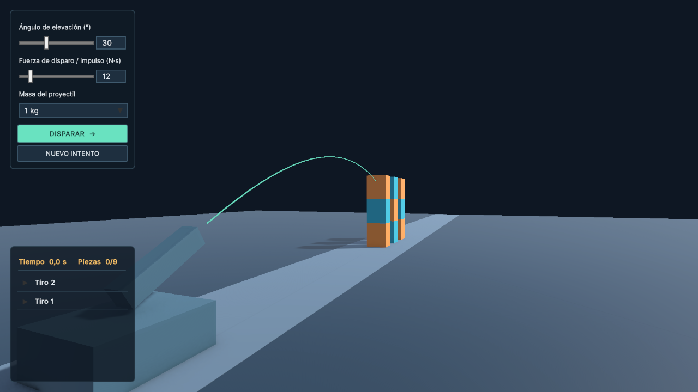

# Simulador balístico · Unity

Proyecto educativo 3D con Rigidbody, FixedJoint y una interfaz hecha con UI Toolkit (UXML + USS). **Unity 6000.4.6f1**, Universal Render Pipeline 17.4.0.



## Cómo jugar

1. Abrir esta carpeta desde Unity Hub con la versión indicada.
2. Abrir `Assets/Ballistics/Scenes/BallisticLab.unity` y presionar **Play**.
3. Usar Game View en **16:9**, preferentemente 1280 × 720 o mayor.
4. Ajustar ángulo (5–75°), fuerza de disparo expresada como impulso (5–60 N·s) y masa (0,5 / 1 / 2 kg). Los sliders también tienen entrada numérica.
5. Pulsar **Disparar**. La simulación observa las colisiones y espera a que los cuerpos se detengan, con un máximo de 12 segundos.
6. Consultar el historial plegable y pulsar **Nuevo intento** para reconstruir los objetivos. El botón también puede interrumpir un proyectil en vuelo.

Solo hace falta el mouse. Durante el tiro se bloquean los parámetros y el botón de disparo, pero **Nuevo intento** permanece habilitado. Al concluir, los cuerpos se congelan hasta reconstruir el campo.

## Física y evaluación

- El lanzamiento aplica `Rigidbody.AddForce(dirección * impulso, ForceMode.Impulse)` una sola vez en FixedUpdate. La velocidad inicial es impulso / masa; la gravedad es la del proyecto (−9,81 m/s²). No se mueve el proyectil mediante Transform.
- La "fuerza" de la interfaz es un **impulso en N·s**, no una fuerza continua en N. Es la magnitud correspondiente a ese modo de AddForce: [documentación de Unity](https://docs.unity3d.com/6000.0/Documentation/ScriptReference/Rigidbody.AddForce.html).
- Proyectil esférico con Rigidbody, SphereCollider, detección continua e interpolación. La línea previa es orientativa: una parábola ideal sin colisiones; el disparo real lo resuelve PhysX.
- Nueve bloques de 0,8 kg en tres columnas, con Rigidbody y BoxCollider. Cada columna usa FixedJoints entre bloques y un anclaje cinemático en la base. Resistencia de rotura: 65 N y 45 N·m. Las piezas empiezan dinámicas, incluso antes del disparo.
- Una pieza cuenta como derribada si, al cerrar el intento, su centro está a más de **0,65 m** de la posición inicial o su rotación difiere más de **35°**. Romper un joint por sí solo no suma puntos.
- También se registran impactos después de que el proyectil ruede o rebote.
- Se esperan al menos tres segundos desde el primer impacto y 0,8 segundos de reposo de todos los cuerpos. Hay límites de tiempo y de salida del campo para que un tiro no bloquee el juego.

## Telemetría e historial

La telemetría principal se limita al tiempo transcurrido y las piezas derribadas. Debajo se muestran los tiros de la sesión, con el más reciente arriba. Cada fila se abre o cierra al hacer clic y contiene la duración, las piezas derribadas y todos los impactos registrados: objeto y punto de contacto, tiempo de vuelo, velocidad relativa e impulso. La rueda del mouse desplaza la lista. La puntuación no se muestra.

El historial vive en memoria y se reinicia al salir de Play Mode. No se crean archivos JSON. Si se pulsa **Nuevo intento** durante un disparo, se registra el resultado parcial como tiro interrumpido y el campo se reconstruye inmediatamente.

El código conserva internamente los eventos `OnCollisionEnter` del proyectil, incluidos el punto, la velocidad relativa y el impulso. Esos datos quedan disponibles para evaluación o ampliaciones, aunque la interfaz simplificada no los presenta.

## Organización

| Carpeta | Contenido |
| --- | --- |
| `Assets/Ballistics/Scenes` | Escena lista para jugar, incluida en Build Settings |
| `Assets/Ballistics/Scripts` | Sesión, proyectil, piezas, datos y enlace de interfaz |
| `Assets/Ballistics/Prefabs` | Proyectil y estructura completa con joints conectados |
| `Assets/Ballistics/UI` | UXML, USS y PanelSettings editables |
| `Assets/Ballistics/Materials` | Materiales visuales y de contacto |
| `Assets/Ballistics/Editor` | Generador de escena y prefabs |
| `Tools` | Generación y verificación automatizada mediante Unity Pipeline |

La escena anterior permanece en `Assets/Scenes`. Si había cambios sin guardar, se preservaron en `BeforeBallisticSetup.unity`.

Para regenerar los assets iniciales: menú **Ballistics → Crear o reconstruir escena**. Esto restablece la escena, materiales y prefabs del simulador; guardar antes cualquier personalización. No es necesario ejecutar el generador para jugar un clon del repositorio.

## Verificación

Con el paquete Unity Pipeline del proyecto y su CLI disponibles:

```powershell
unity command --project-path . editor_play
unity command --project-path . --timeout 58 run_script --file Tools/VerifyLab.cs --timeout_ms 55000
unity command --project-path . editor_stop
```

Abrir primero BallisticLab y esperar a que Play termine de cargar. La verificación espera seis segundos sin disparar, comprueba nueve piezas y nueve joints intactos, ejecuta tres tiros y verifica la física, la telemetría y el orden del historial. No ejecutar dos verificaciones simultáneas.

Los controles se pueden verificar manualmente variando cada slider y la masa, comprobando que la velocidad inicial y la trayectoria cambien, y que no sea posible disparar dos veces durante el mismo intento.

La prueba `Tools/VerifyControls.cs`, ejecutada con `run_script` en Play, también comprueba el enlace de sliders, las tres masas, el reinicio durante el vuelo y el historial con los tiros más recientes primero.

Resultados de la verificación en Unity 6000.4.6f1: nueve piezas y nueve joints intactos tras seis segundos; tiros de 7 N·s / 1 kg, 12 N·s / 1 kg y 24 N·s / 2 kg a 30° con 0, 7 y 8 piezas derribadas, respectivamente. Los resultados exactos pueden variar ligeramente entre plataformas por el solver físico.

## Git y entrega

Versionar `Assets/` (incluidos los `.meta`), `Packages/`, `ProjectSettings/`, `Tools/`, README y `.gitignore`. Se excluyen Library, Temp, Logs, UserSettings, builds y archivos de IDE. El repositorio remoto y la publicación se configuran con la cuenta del autor.

## Video de YouTube

**Enlace: pendiente de grabar y publicar.**

Guion sugerido, 1–3 minutos: mostrar la interfaz y la estabilidad inicial; hacer un tiro a 30° / 7 N·s / 1 kg, otro a 30° / 12 N·s / 1 kg y otro a 30° / 24 N·s / 2 kg; desplegar algunas filas del historial y mostrar un reinicio durante el vuelo. Explicar que duplicar impulso y masa conserva la velocidad inicial pero aumenta el momento del proyectil. Sustituir este texto por el enlace real antes de entregar.

