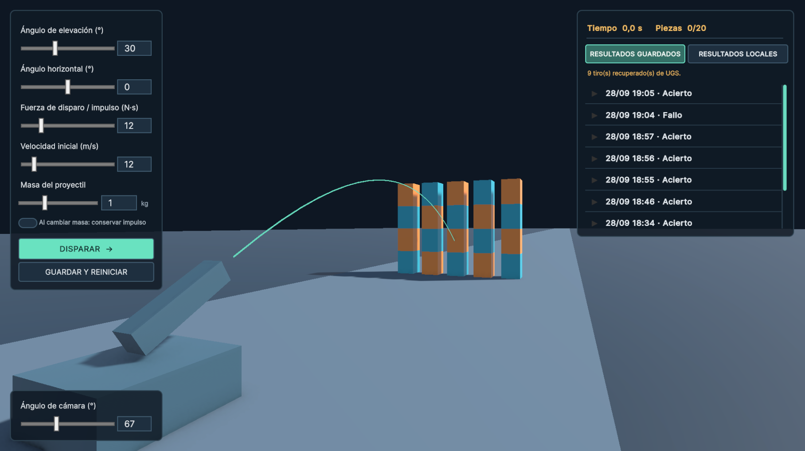

# Simulador balístico + UGS

Simulador 3D hecho en **Unity 6000.4.6f1**. El objetivo es ajustar el disparo para derribar una estructura de bloques.

## Controles

| Control | Función |
| --- | --- |
| Ángulo de elevación | Inclina el disparo hacia arriba o abajo. |
| Ángulo horizontal | Apunta hacia los lados. |
| Fuerza de disparo / impulso | Cambia el impulso aplicado al proyectil, medido en N·s. |
| Velocidad inicial | Ajusta la velocidad de salida en m/s; el impulso se recalcula automáticamente. |
| Masa del proyectil | Permite elegir entre 0,1 y 50 kg con el slider o escribir un valor exacto. |
| Conservar impulso / velocidad | Al cambiar la masa, decide cuál de los dos valores permanece fijo. El otro se ajusta según `velocidad = impulso / masa`. |
| **Disparar** | Lanza el proyectil. |
| **Guardar y reiniciar** | Reconstruye los objetivos. Si hay un tiro en curso, lo finaliza y registra su resultado antes de reiniciar. |

El slider **Ángulo de cámara**, en la esquina inferior izquierda, gira la cámara entre 0° y 180°. Comienza en 67° y se puede mover durante el disparo.

## Registro de tiros

El panel de la esquina superior derecha muestra los tiros de la sesión, con el más reciente arriba. Cada tiro se puede desplegar para ver su duración, las piezas derribadas y los impactos registrados. De cada impacto se muestra el objeto, tiempo de vuelo, punto de contacto, velocidad relativa e impulso de colisión.

Una esfera amarilla marca los impactos contra los bloques. En el registro, **Mostrar/Ocultar** permite ver un punto específico o todos los puntos de un tiro. Al seleccionar otro tiro, se ocultan los marcadores del anterior. El registro se reinicia al salir de Play.

## Resultados guardados en UGS

Al finalizar cada tiro, sus resultados se guardan automáticamente en Unity Gaming Services mediante Cloud Save. El botón Guardar y reiniciar permite finalizar un tiro en curso, guardar sus resultados y preparar el siguiente intento.
- **Resultados locales:** muestra los tiros de la sesión actual, con el detalle de los impactos y botones para visualizar sus posiciones.
- **Resultados guardados:** recupera el historial desde UGS, ordenado del más reciente al más antiguo. Incluye ángulos, impulso, masa, acierto, distancia horizontal, piezas derribadas y duración del tiro.

El guardado y la consulta requieren conexión a Internet. Se utiliza autenticación anónima: el historial corresponde al jugador identificado en ese dispositivo.

## Criterios de evaluación

- **Controles:** ángulo, impulso, velocidad y masa ajustables desde la interfaz.
- **Disparo físico:** proyectil con Rigidbody y Collider, lanzado mediante `AddForce` según los ángulos elegidos.
- **Objetivos:** bloques con Rigidbody conectados por FixedJoint, estables antes del disparo.
- **Resultados:** registro por tiro del tiempo de vuelo, punto de impacto, velocidad relativa, impulso de colisión y piezas derribadas.
- **Persistencia:** guarda automáticamente los resultados de cada disparo en UGS y los recupera desde la interfaz, incluso después de cerrar y volver a abrir el simulador.

## Video

**Primer versión:** https://youtu.be/esqKGpsQuRk
**Versión con persistencia de datos:** https://youtu.be/rpDA-uI0alw
